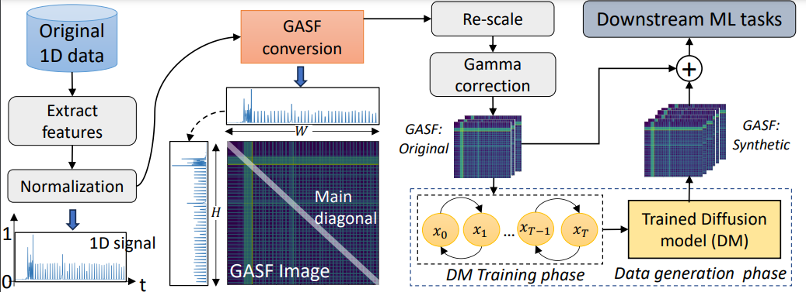

# How to start NetDiffus

> :warning: This set up is only for development/prototyping <u>DO NOT</u> use it in production :warning:


To run gasf_conversion go in root directory Progetto/ and type 

```bash
python NetDiffus/gasf_conversion.py materiale/Mirage-AppxActRidotto1600Aggiunti0.parquet materiale/datiOriginali_GASF
```


To run image_train.py put make sure you're again in Progetto/ and type the follow comand:

```bash
python NetDiffus/scripts/image_train.py --data_dir materiale/datiOriginali_GASF --image_size 128 --num_channels 128 --num_res_blocks 3 --diffusion_steps 100 --noise_schedule cosine --learn_sigma True --class_cond True --rescale_learned_sigmas False --rescale_timesteps False --lr 5e-5 --batch_size 1
```

To run image_sample, go again in Progetto/ and

```bash
  python NetDiffus/scripts/image_sample.py --model_path 128/iterate/df/synth_models/model003000.pt --image_size 10 --num_channels 128 --num_res_blocks 3 --diffusion_steps 100 --noise_schedule cosine --learn_sigma True --class_cond True --rescale_learned_sigmas False --rescale_timesteps False
```

# How to start NetDiffus_Old

> :warning: This set up is only for development/prototyping <u>DO NOT</u> use it in production :warning:


To run gasf_conversion go in root directory Progetto/materiale and run [gasf_conversion_appx.py](materiale/gasf_conversion_appx.py)

```bash

python materiale/gasf_conversion_appx.py 

```


To run _image_train.py_ put make sure you're again in Progetto/ and type the follow comand:

```bash
python NetDiffus_Old/scripts/image_train.py --data_dir materiale/datiOriginali_GASF --image_size 128 --num_channels 128 --num_res_blocks 3 --diffusion_steps 100 --noise_schedule cosine --learn_sigma True --class_cond True --rescale_learned_sigmas False --rescale_timesteps False --lr 5e-5 --batch_size 1
```

To run _image_sample_, go again in Progetto/ and

```bash
  python NetDiffus_Old/scripts/image_sample.py --model_path 128/iterate/df/synth_models/model003000.pt --image_size 10 --num_channels 128 --num_res_blocks 3 --diffusion_steps 100 --noise_schedule cosine --learn_sigma True --class_cond True --rescale_learned_sigmas False --rescale_timesteps False
```
> :warning: Adjust training and generation parameters depends on your hardware :warning:

# NetDiffus
This is repository of the project Mirage Appx, presented at Data analytics course at University Federico II.

# Requirements

- Python 3.9
- guided-diffusion
- torch
- tqdm
- blobfile>=1.0.5

# About NetDiffus

While Machine-Learning based network data analytics are now common-
place for many networking solutions, nonetheless, limited access to appropriate
networking data has been an enduring challenge for many networking problems.
Causes for lack of such data include complexity of data gathering, commercial
sensitivity, as well as privacy and regulatory constraints. To overcome these
challenges, we present a Diffusion-Model (DM) based end-to-end framework,
NetDiffus, for synthetic network traffic generation which is one of the emerg-
ing topics in networking and computing system. NetDiffus first converts one-
dimensional time-series network traffic into two-dimensional images, and then
synthesizes representative images for the original data. We demonstrate that
NetDiffus outperforms the state-of-the-art traffic generation methods based on
Generative Adversarial Networks (GANs) by providing 66.4% increase in the
fidelity of the generated data and an 18.1% increase in downstream machine
learning tasks. We evaluate NetDiffus on seven diverse traffic traces and show
that utilizing synthetic data significantly improves several downstream ML tasks
including traffic fingerprinting, anomaly detection and traffic classification.



We have released the data for the purpose of re-implementing and testing the algoirhtm [here](https://drive.google.com/drive/folders/1qoNrghez1vffgApGe9SnUXSzV9fx6unz?usp=sharing). This dataset is not the complete one. Complete dataset will be available upon the request.

Run the command below to convert the extracted features in the csv files to GASF images.
```commandline
 python gasf_conversion.py
```

    Data structure for data generationn is as follows:
    - Youtube
        -vid1
            -vid1_1.png
            -vid1_2.png
            - ...
        -vid2
            - ...
        - ...

# Run Scripts

To start the training process you can run the following command:

```commandline
 python scripts/image_train.py --data_dir <dataset_path> --image_size 128 --num_channels 128 --num_res_blocks 3 --diffusion_steps 1000 --noise_schedule cosine --learn_sigma True --class_cond True --rescale_learned_sigmas False --rescale_timesteps False --lr 1e-4 --batch_size 4
```

To generate the data you can run the following command:

```commandline
  python scripts/image_sample.py --model_path <trained_model_path> --image_size 128 --num_channels 128 --num_res_blocks 3 --diffusion_steps 1000 --noise_schedule cosine --learn_sigma True --class_cond True --rescale_learned_sigmas False --rescale_timesteps False
```

You can run the classifier.py to get the classification results.

# Acknowledgements
This code is developed on the OpenAI's [Guided Diffusion](https://github.com/openai/guided-diffusion).
